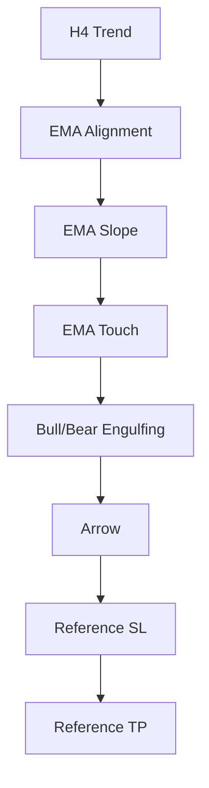

# Project REI

## Version

Version 1.3

---

## Purpose

Version 1.3では、エントリー品質を維持したまま、以下を追加する。

- 包み足フィルター
- 参考SL
- 参考TP

EA機能はまだ実装しない。

参考ラインは裁量トレード支援を目的とする。

---

## Base Logic

Version 1.2 revised をそのまま継承する。

以下は変更しない。

- H4方向判定
- EMA配列
- EMA傾き
- EMAタッチ
- ロンドン時間
- ニュースフィルター
- 矢印制御

---

## New Features

### 1

Bullish Engulfing Filter

### 2

Bearish Engulfing Filter

### 3

Reference Stop Loss

### 4

Reference Take Profit

---

## Bullish Engulfing

ロング条件

前足

陰線

現在足

陽線

現在足の実体が前足実体を包む。

input

- EnableEngulfingFilter
- EngulfingBodyRatio

判定内容

- 前足の終値が始値より低い
- 現在足の終値が始値より高い
- 現在足の始値が前足の終値以下
- 現在足の終値が前足の始値以上
- 現在足の実体が前足実体 x EngulfingBodyRatio 以上

---

## Bearish Engulfing

ショート条件

前足

陽線

現在足

陰線

現在足実体が前足実体を包む。

判定内容

- 前足の終値が始値より高い
- 現在足の終値が始値より低い
- 現在足の始値が前足の終値以上
- 現在足の終値が前足の始値以下
- 現在足の実体が前足実体 x EngulfingBodyRatio 以上

---

## Reference Stop Loss

MT4版

標準ZigZag

直近確定高安値

FT版

内部Swing判定

未来データは使用しない

ロングの場合

- シグナル足より左側にある直近確定安値を使用する
- SLがEntry以上の場合は表示しない

ショートの場合

- シグナル足より左側にある直近確定高値を使用する
- SLがEntry以下の場合は表示しない

---

## Reference Take Profit

Risk Reward

1 : 2

TP

Entry ± Risk x 2

参考ラインのみ

EAでは使用しない。

ロングの場合

- Risk = Entry - Stop Loss
- TP = Entry + Risk x RiskRewardRatio

ショートの場合

- Risk = Stop Loss - Entry
- TP = Entry - Risk x RiskRewardRatio

---

## Inputs

| Input | Default | Description |
| --- | --- | --- |
| HistoricalBars | 5000 | 過去検証でスキャンする最大バー数 |
| RecalculateBars | 300 | FT版で2回目以降に再計算する直近バー数 |
| SlopeLookback | 5 | EMA傾き判定に使う比較本数 |
| EnableAlert | true | MT4版のAlert通知を有効化 |
| EnablePopup | true | MT4版のポップアップ通知を有効化 |
| EnableArrow | true | MT4版の矢印表示を有効化 |
| ShowDebugEMALines | true | MT4版の確認用EMAライン表示 |
| ShowEMALines | false | FT版のEMAライン表示 |
| ArrowOffsetPips | 3.0 | MT4版の矢印表示位置オフセット |
| BuyArrowColor | C'104,169,178' | BUY矢印色 |
| SellArrowColor | C'205,139,157' | SELL矢印色 |
| EnableLondonTimeFilter | true | ロンドン時間フィルター |
| LondonStartHour | 15 | サーバー時間基準のロンドン開始時刻 |
| LondonEndHour | 22 | サーバー時間基準のロンドン終了時刻 |
| UseJapanTimeForLondonSession | true | JST変換によるロンドン時間判定 |
| BrokerToJSTOffsetHours | 6 | ブローカー時間からJSTへの変換オフセット |
| LondonStartHourJST_Summer | 16 | 夏時間のJSTロンドン開始時刻 |
| LondonEndHourJST_Summer | 24 | 夏時間のJSTロンドン終了時刻 |
| LondonStartHourJST_Winter | 17 | 冬時間のJSTロンドン開始時刻 |
| LondonEndHourJST_Winter | 25 | 冬時間のJSTロンドン終了時刻 |
| UseSummerTime | true | 夏時間設定 |
| EnableNewsFilter | false | ニュース除外フィルター |
| NewsTimes | "" | 手動入力する重要指標時刻 |
| NewsAvoidMinutesBefore | 30 | ニュース前の回避分数 |
| NewsAvoidMinutesAfter | 30 | ニュース後の回避分数 |
| EnableTokyoRangeFilter | false | 互換用。V1.3のコア条件では使用しない |
| EnableH4ReversalPatternFilter | false | 互換用。V1.3のコア条件では使用しない |
| EnableEngulfingFilter | true | 包み足フィルター |
| EngulfingBodyRatio | 1.0 | 包み足の実体比率 |
| EnableReferenceSLTP | true | 参考SL/TP表示 |
| ZigZagDepth | 12 | MT4版ZigZagのDepth |
| ZigZagDeviation | 5 | MT4版ZigZagのDeviation |
| ZigZagBackstep | 3 | MT4版ZigZagのBackstep |
| ZigZagSearchBars | 500 | MT4版ZigZag探索本数 |
| ZigZagConfirmBars | 3 | MT4版ZigZag確定確認本数 |
| SwingLookback | 3 | FT版内部Swing判定の左右比較本数 |
| SwingSearchBars | 500 | FT版内部Swing探索本数 |
| RiskRewardRatio | 2.0 | 参考TP計算に使うRR |
| ReferenceLineLengthBars | 40 | 参考SL/TPライン表示本数 |
| ReferenceSLColor | LightCoral | 参考SL色 |
| ReferenceTPColor | LightBlue | 参考TP色 |
| ReferenceLineWidth | 1 | MT4版参考ライン幅 |
| ReferenceLineStyle | STYLE_DASH | 参考ライン種類 |
| ShowReferenceEntryLine | false | MT4版参考Entryライン表示 |
| EnableSLTPDebugLog | false | MT4版SL/TPデバッグログ |

---

## Signal Flow

---

## MT4 Version

使用する機能

- ObjectCreate
- ZigZag
- Reference Lines

MT4版では、標準ZigZagを利用して参考SL/TPの基準点を取得する。

参考SL/TPはチャートオブジェクトとして表示する。

---

## Forex Tester Version

ObjectCreateは使用しない

Swing判定

SLTPバッファ表示

高速化維持

FT版では、標準ZigZagのiCustom呼び出しを使用しない。

内部Swing判定で直近高安値を取得し、SL/TPはインジケーターバッファで表示する。

---

## Development Notes

Version 1.3ではExit Logicは完成させない。

SL

TP

は参考ラインのみ。

実際の決済ロジックは8月のProp Challengeで検証し、Version 2で決定する。

---

## Future Tasks

Version 1.4

- SLロジック改善
- TPロジック改善

Version 2

- EA

Version 3

- Optimization

---

## Development Philosophy

Project REIでは、市場参加者の心理をロジック化することを目的とする。

EMAは支持線・抵抗線として扱う。

包み足は買い手・売り手の勢力転換として扱う。

ロジックはできる限りシンプルに保つ。

追加条件は十分な検証後のみ採用する。

Project REI does not aim to maximize the number of signals.

Its objective is to generate high-quality trading opportunities that a discretionary trader would actually execute.

The philosophy of Project REI is to transform market participant psychology into objective trading rules.

---

## Decision Log

Version1.3で決定した設計思想

- H4方向は確定したH4足で判定する。
- EMAは支持線・抵抗線として扱う。
- EMAへの押し目・戻りは複数回許可する。
- 「トレンド終盤」という理由だけではシグナルを除外しない。
- 包み足は買い手・売り手の勢力転換として扱う。
- Stop Loss と Take Profit は現時点では参考ラインのみとする。
- 実際のExit Logicは8月のProp Challengeで検証し、Version2(EA)で正式決定する。
- ロジックは可能な限りシンプルに保ち、十分な検証結果が得られた条件のみ採用する。

---

## Non Goals

Version1.3では以下は実装対象外とする。

- EA機能
- 自動発注
- 自動決済
- Trailing Stop
- Break Even
- Partial Close
- Lot計算
- 複利運用
- Exit Logic最適化
- 勝率向上を目的としたロジック追加

Version1.3は

「エントリー品質の完成」

のみを目的とする。

---

## Acceptance Criteria

Version1.3は以下をすべて満たした場合に完成とする。

- 包み足フィルターONで正常動作する。
- 包み足フィルターOFFではVersion1.2と同じシグナルになる。
- BUYのReference SLが直近確定Swing安値になる。
- SELLのReference SLが直近確定Swing高値になる。
- Reference TPがRisk Reward 1:2になる。
- MT4版が警告・エラーなくコンパイルできる。
- FT版がFT4へ正常変換できる。
- Forex Testerで表示確認できる。
- 約300シグナル以上のバックテストを実施する。
- 明らかなロジック不整合がない。

---

## Change History

Version 1.3

- Bullish Engulfing追加
- Bearish Engulfing追加
- Reference SL追加
- Reference TP追加
- MT4 / FT仕様を分離
